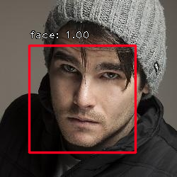

# Face Detection
Trainning a face detector by transfer learning based on [keras-retinanet](https://github.com/fizyr/keras-retinanet).

## Install keras-retinanet  
   You'd better use ubuntu system rather than windows system.  

1) Clone [keras-retinanet](https://github.com/fizyr/keras-retinanet).
2) In the repository, execute `pip install . --user`.
   Note that due to inconsistencies with how `tensorflow` should be installed,
   this package does not define a dependency on `tensorflow` as it will try to install that (which at least on Arch Linux results in an incorrect installation).
   Please make sure `tensorflow` is installed as per your systems requirements.
3) Alternatively, you can run the code directly from the cloned  repository, however you need to run `python setup.py build_ext --inplace` to compile Cython code first.
4) Optionally, install `pycocotools` if you want to train / test on the MS COCO dataset by running `pip install --user git+https://github.com/cocodataset/cocoapi.git#subdirectory=PythonAPI`.

**tested configure:**
```
keras-retinanet-0.4.1  
keras-2.2.2  
tensorflow-1.4.0+  
Pillow-5.2.0, lower version maybe has a bug in keras-retinanet  
Python2.7+ or Python3.6+
OpenCV2.4+ or OpenCV3.0+
```

## Testing
1) Dowload pretrained model [face_detector.resnet50_retinanet.inference.h5](https://pan.baidu.com/s/1KqHCoDF-Wvbyi1TE35dSKQ)  
2) Move to keras-retinanet/model/
3) Execute run.evaluate.image.sh to detect face in a image. For evaluating thousands of images, you should use run.evaluate.csv.sh. If you have a webcam, you can also execute run.evaluate.video.sh to detect face.
   
**bugs:**  
```
File "keras_retinanet/bin/../../keras_retinanet/utils/anchors.py", line 20, in <module>
    from ..utils.compute_overlap import compute_overlap
ImportError: No module named compute_overlap
```
add the following texts to anchos.py before "from ..utils.compute_overlap import compute_overlap"
```buildoutcfg
import pyximport
pyximport.install()

from ..utils.compute_overlap import compute_overlap
```

result:  



## Training
### 1. Save annotations to csv files.  
**(1)training annotations**  
training csv file: images.train.csv  
format: image_path,left,top,right,bottom,class_name    
If one image has more than one face, each face's annotation use one line.
  
for example(009.jpg has two faces):
```
/opt/images/008.jpg,45,62,194,211,face
/opt/images/009.jpg,45,62,194,211,face
/opt/images/009.jpg,xx,xx,xxx,xxx,face
/opt/images/010.jpg,45,62,194,211,face
```
  
**(2)classes file**  
classes csv file: classes.csv
for example:
```
face,0
```
**(3)optionally, validation file**  
validation csv file: images.val.csv  
for example:
```
/opt/images/008.jpg,45,62,194,211,face
/opt/images/009.jpg,45,62,194,211,face
```    

### 2. execute train.py
use keras_retinanet/bin/train.py to train face detector, but train.py is hard to use because some arguements should place in right place.Otherwise, it will not work.
You can use run.train.sh to train face detector. The script shows the right way of using train.py. Before transfer learning, you should download [ResNet-50-model.keras.h5](https://pan.baidu.com/s/1KqHCoDF-Wvbyi1TE35dSKQ), and move it to ~/.keras/models.
    
**transfer learning with frozen backbone**
```shell
python keras_retinanet/bin/train.py --gpu 0 --snapshot-path ./snapshots --backbone resnet50 --batch-size 1 --epochs 2000 --steps 1000 --tensorboard-dir=./log --freeze-backbone --weights ~/.keras/models/ResNet-50-model.keras.h5 csv images.train.csv classes.csv

```

**transfer learning without frozen backbone**
```shell
python keras_retinanet/bin/train.py --gpu 0 --snapshot-path ./snapshots --backbone resnet50 --batch-size 1 --epochs 2000 --steps 1000 --tensorboard-dir=./log --weights ~/.keras/models/ResNet-50-model.keras.h5 csv images.train.csv classes.csv

```

### 3. Converting a training model to inference model
The training procedure of `keras-retinanet` works with *training models*. These are stripped down versions compared to the *inference model* and only contains the layers necessary for training (regression and classification values). If you wish to do inference on a model (perform object detection on an image), you need to convert the trained model to an inference model. This is done as follows:

```shell
# Running directly from the repository:
keras_retinanet/bin/convert_model.py /path/to/training/model.h5 /path/to/save/inference/model.h5

# Using the installed script:
retinanet-convert-model /path/to/training/model.h5 /path/to/save/inference/model.h5
```

### 4. Evaluate the trained inference model
run.evaluate.csv.sh
```shell
python keras_retinanet/bin/evaluate.py csv images.val.csv classes.csv ./model/face_detector.resnet50_retinanet.inference.h5
```

 
